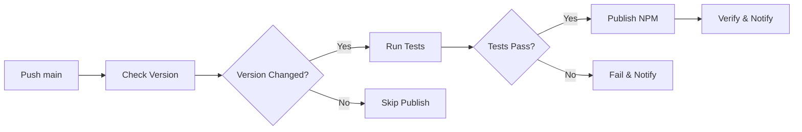

# 📦 Processo de Publicação Automática - Frontend Flow

Este documento descreve o sistema de publicação automática no NPM via GitHub Actions.

## 🚀 Visão Geral

O Frontend Flow v2.0+ possui **publicação automática** configurada que:
- **Detecta mudanças de versão** no `package.json`
- **Executa testes automáticos** da estrutura Enhanced
- **Publica no NPM** quando push é feito na branch `main`
- **Verifica publicação** e notifica resultados

## 🔧 Setup Inicial (Uma Vez Só)

### **1. Token NPM**
```bash
# 1. Vá para https://npmjs.com → Access Tokens
# 2. Generate New Token → Automation
# 3. Copie o token
```

### **2. GitHub Secret**
```bash
# 1. GitHub Repository → Settings → Secrets and variables → Actions
# 2. New repository secret:
#    Name: NPM_TOKEN
#    Value: [seu token NPM]
```

### **3. Desabilitar 2FA** (NPM)
```bash
# Para automação sem OTP, desabilite 2FA temporariamente
# NPM → Account Settings → Two-Factor Authentication → Disable
```

## 📈 Como Fazer Release

### **Método 1: Script Automático (Recomendado)**
```bash
# Execute o helper script
./scripts/bump-version.sh

# Siga o wizard interativo:
# 1. Escolha tipo: patch/minor/major/custom
# 2. Confirme commit message
# 3. Confirme push automático
# 4. Aguarde publicação
```

### **Método 2: Manual**
```bash
# 1. Incremente versão
npm version patch   # 2.0.0 → 2.0.1
npm version minor   # 2.0.0 → 2.1.0
npm version major   # 2.0.0 → 3.0.0

# 2. Commit e push
git add .
git commit -m "feat: bump version to $(node -p 'require("./package.json").version')"
git push origin main

# 3. Aguarde GitHub Actions
```

### **Método 3: Publicação Forçada**
```bash
# Via GitHub CLI
gh workflow run "publish-npm.yml" -f force_publish=true

# Via GitHub Web
# Actions → Publish to NPM → Run workflow → force_publish: true
```

## 🔄 Fluxo Automático



### **Etapas Detalhadas**

#### **1. 🔍 Check Version**
- Compara `package.json` vs versão NPM atual
- Decide se deve prosseguir com publicação
- Pula se versão não mudou (a menos que forçado)

#### **2. 🧪 Test**
- Instala dependências: `npm ci`
- Testa estrutura Enhanced: agentes Claude, configs
- Valida package structure: `npm pack --dry-run`
- Executa integration test: `node test-integration.js`

#### **3. 🚀 Publish**
- Autentica no NPM com token
- Executa `npm publish --access public`
- Aguarda propagação (10s)
- Verifica se versão foi publicada

#### **4. 📊 Notify**
- Cria summary no GitHub Actions
- Mostra detalhes da publicação
- Lista features da nova versão

## 📊 Monitoramento

### **GitHub Actions**
```bash
# Ver status dos workflows
gh run list --workflow="publish-npm.yml"

# Ver logs detalhados
gh run view --log

# URL direto: https://github.com/seu-repo/actions
```

### **NPM Status**
```bash
# Verificar versão publicada
npm info frontend-flow-agents

# Verificar se publicou
npm view frontend-flow-agents version

# Testar instalação
npm install -g frontend-flow-agents@latest
frontend-flow --version
```

## 🚨 Troubleshooting

### **🔴 Workflow Não Roda**

**Sintomas**: Push feito mas workflow não aparece

**Verificações**:
```bash
# 1. Arquivo existe?
ls -la .github/workflows/publish-npm.yml

# 2. YAML válido?
yamllint .github/workflows/publish-npm.yml

# 3. Branch correta?
git branch  # Deve ser 'main'

# 4. Path ignorado?
# Verifique se mudanças não estão em paths-ignore
```

### **🟡 Tests Falham**

**Sintomas**: `❌ All tests passed!` no log

**Soluções**:
```bash
# Teste local primeiro
npm ci
node test-integration.js

# Verifique estrutura Enhanced
ls -la agents/claude-enhanced/
ls -la lib/claude-enhanced/
```

### **🔴 NPM Token Inválido**

**Sintomas**: `401 Unauthorized` no NPM

**Soluções**:
```bash
# 1. Regenerar token no NPM
# 2. Atualizar secret no GitHub
# 3. Re-run workflow
gh run rerun --failed
```

### **🟡 Versão Já Existe**

**Sintomas**: `Cannot publish over existing version`

**Soluções**:
```bash
# Incrementar versão
npm version patch
git commit -am "bump version"
git push origin main
```

## 📋 Checklist Pré-Publicação

### **Para Releases Importantes**
- [ ] **Testes locais** executados e passando
- [ ] **Enhanced features** funcionando corretamente
- [ ] **README** atualizado com novas features
- [ ] **CHANGELOG** atualizado (se aplicável)
- [ ] **Version bump** apropriado (patch/minor/major)
- [ ] **Breaking changes** documentadas

### **Para Hotfixes**
- [ ] **Bug fix** testado localmente
- [ ] **Patch version** incrementada
- [ ] **Commit message** descritivo
- [ ] **Fast-track** sem quebrar automação

## 🎯 Best Practices

### **Versionamento Semântico**
```bash
# PATCH (2.0.0 → 2.0.1): Bug fixes
npm version patch

# MINOR (2.0.0 → 2.1.0): New features (backward compatible)
npm version minor

# MAJOR (2.0.0 → 3.0.0): Breaking changes
npm version major
```

### **Commit Messages**
```bash
# Boas práticas
git commit -m "feat: add real-time dashboard monitoring"
git commit -m "fix: resolve WebSocket connection timeout"
git commit -m "docs: update Enhanced features documentation"

# Evitar
git commit -m "update"
git commit -m "fix bug"
```

### **Release Timing**
- **🌅 Morning**: Releases durante horário comercial
- **🧪 Test first**: Sempre teste localmente primeiro
- **📊 Monitor**: Acompanhe GitHub Actions após push
- **⚠️ Hotfixes**: Só em emergências

## 🔄 Reversão (Se Necessário)

### **NPM Deprecate**
```bash
# Deprecar versão problemática
npm deprecate frontend-flow-agents@2.0.1 "Use version 2.0.0 instead"

# Republicar versão anterior como latest
npm dist-tag add frontend-flow-agents@2.0.0 latest
```

### **Git Revert**
```bash
# Reverter commit problemático
git revert HEAD
git push origin main
# Isso criará uma nova versão com a reversão
```

---

**🎉 Com este setup, publicações são automáticas, confiáveis e monitoradas!**

Para dúvidas ou problemas, consulte:
- 📋 GitHub Actions logs
- 📦 NPM package status
- 🧪 Integration tests local